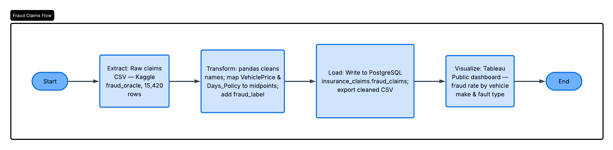

# Auto Insurance Fraud Detection

ETL pipeline and interactive dashboard analyzing the Kaggle "fraud_oracle" auto insurance claims dataset (15,420 claims).

**Live dashboard:** [Tableau Public](https://public.tableau.com/app/profile/lisa.lewandowski/viz/auto_insurance_fraud_dashboard/AutoInsuranceFraudDetection?publish=yes)

**Companion dashboard (Google Looker Studio):** [Auto Insurance Fraud Detection](https://lookerstudio.google.com/reporting/c36a3b5e-0fb9-466a-a0e4-06789af5cc06) — same KPIs and findings, built on the same cleaned dataset via Google Sheets + `IMPORTDATA`

## Pipeline

1. **Extract** — load raw claims CSV (`data/fraud_oracle.csv`)
2. **Transform** (`etl/extract_transform.py`) — clean column names, map `VehiclePrice` and `Days_Policy_*` ranges to numeric midpoints, add a readable `fraud_label`
3. **Load** — write to a `fraud_claims` table in PostgreSQL (`insurance_claims` db) and export a cleaned CSV for Tableau

```
cd etl
python3 extract_transform.py
```



*Process flow diagrammed in Lucidchart.*

## Key findings

- Overall fraud rate: **6.0%** (923 of 15,420 claims)
- Claims where the **policyholder is at fault** show a fraud rate roughly 8.8x higher than third-party-fault claims (7.9% vs. 0.9%)
- Fraud rate varies substantially by vehicle make, with some makes far above the overall average

## Stack

Python (pandas, SQLAlchemy) → PostgreSQL → Tableau Desktop/Public
