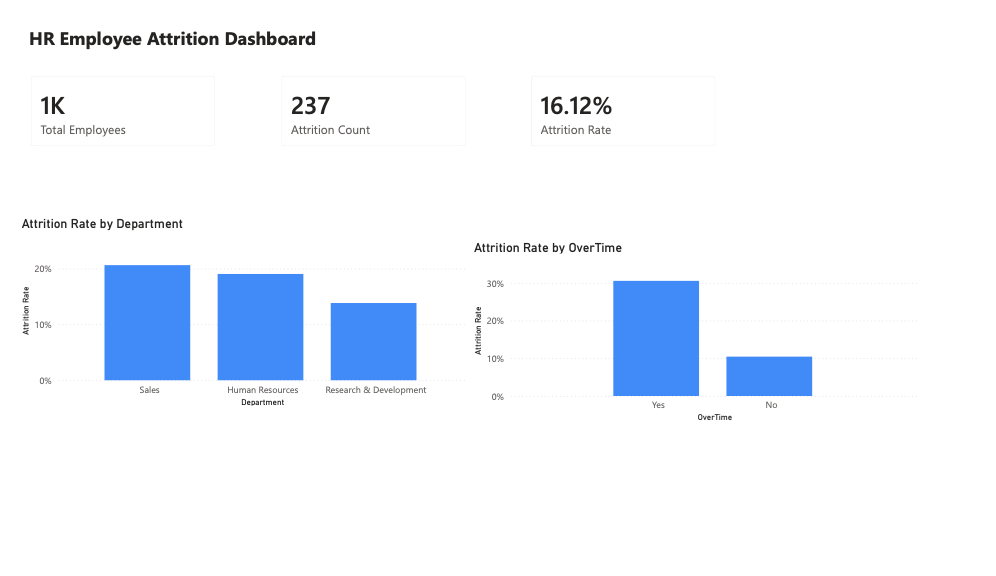

# HR Employee Attrition Dashboard

Power BI dashboard analyzing the IBM HR Analytics Employee Attrition & Performance dataset (1,470 employees, 35 attributes).



**Report file:** [`dashboard/HR_Attrition_Dashboard.pbix`](dashboard/HR_Attrition_Dashboard.pbix) — open in Power BI Desktop (free) to explore interactively.

## Measures (DAX)

```
Total Employees = COUNTROWS('WA_Fn-UseC_-HR-Employee-Attrition')

Attrition Count = CALCULATE(
    COUNTROWS('WA_Fn-UseC_-HR-Employee-Attrition'),
    'WA_Fn-UseC_-HR-Employee-Attrition'[Attrition] = "Yes"
)

Attrition Rate = DIVIDE([Attrition Count], [Total Employees], 0)
```

## Key findings

- Overall attrition rate: **16.12%** (237 of 1,470 employees)
- Employees who work **overtime** attrition at roughly **3x** the rate of those who don't (~30% vs ~10%)
- **Sales** has the highest departmental attrition rate, followed by Human Resources, then Research & Development

## Stack

Power BI Desktop (Windows, via Parallels Desktop VM) — CSV import, DAX measures, card and clustered column visuals.

Companion piece to the [auto insurance fraud detection dashboard](../fraud-detection-etl/) (Tableau).
