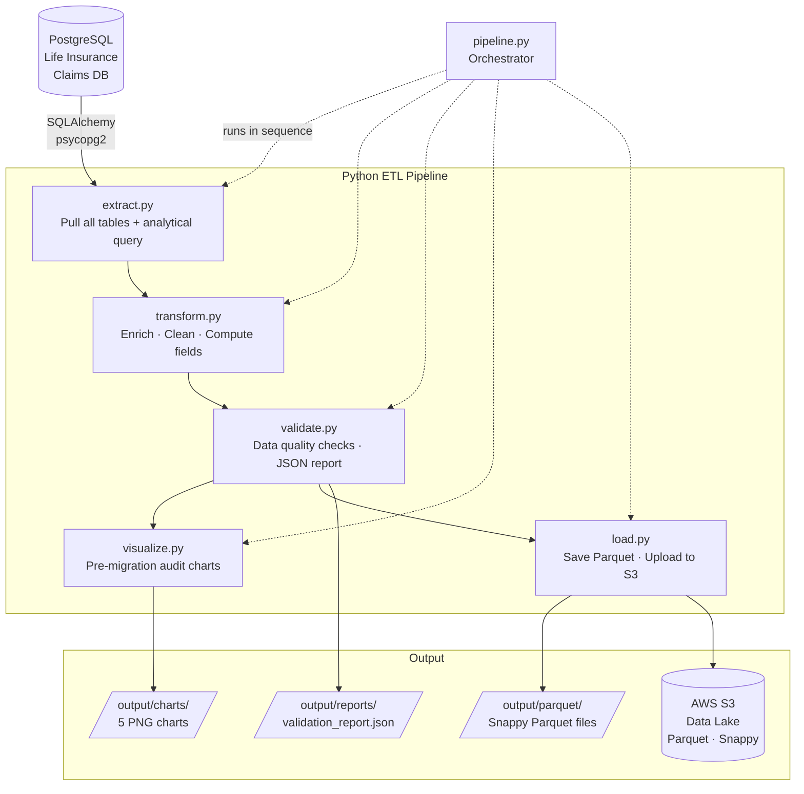

# Insurance Claims Cloud Migration Pipeline

A Python data engineering pipeline that migrates a life insurance claims database from PostgreSQL to AWS S3 (Parquet data lake format). Built as a direct extension of the [Life Insurance Claims Database](../life-insurance-claims-db) project.

---

## Architecture



---

## Files

| File | Purpose |
|------|---------|
| `config.py` | Centralized config — DB, AWS, paths, bins, thresholds via `.env` |
| `extract.py` | Pulls all 9 source tables + pre-built analytical query from PostgreSQL |
| `transform.py` | Enriches DataFrames — age bands, tenure tiers, processing metrics |
| `validate.py` | 20+ data quality checks — nulls, uniqueness, referential integrity, business rules |
| `visualize.py` | 5 pre-migration audit charts using matplotlib + seaborn |
| `load.py` | Saves Parquet locally (Snappy compressed) + uploads to AWS S3 |
| `pipeline.py` | End-to-end orchestrator with stage timing and run summary JSON |
| `requirements.txt` | All dependencies |
| `.env.example` | Template for environment variables |

---

## Pipeline Stages

### 1. Extract
Connects to the PostgreSQL source database via SQLAlchemy and pulls every table into a pandas DataFrame. Also runs a pre-built SQL query that produces a denormalized **claims fact table** (joins claims + policies + policyholders + beneficiaries + agents) — the primary analytical table for the cloud warehouse.

Saves raw Parquet snapshots before any transformation.

### 2. Transform
Enriches each DataFrame with computed fields:

| Table | Fields Added |
|-------|-------------|
| `policyholders` | `current_age`, `tenure_years`, `tenure_tier` |
| `policies` | `age_band`, `is_permanent`, `years_in_force`, `premium_per_1k_coverage`, `days_until_expiry`, `has_riders` |
| `claims` | `days_to_decision`, `days_open`, `aging_flag`, `claim_year/month/quarter`, `is_high_value`, `processing_category`, `days_death_to_filing` |
| `claims_fact` | All of the above, denormalized into one flat table |

### 3. Validate
Runs **20+ data quality checks** before any data leaves the source environment:

| Check Type | Examples |
|------------|---------|
| **Null checks** | claim_number, policy_id, date_filed, claim_amount required |
| **Uniqueness** | claim_number, policy_number must be unique |
| **Valid enums** | status values must be in allowed set |
| **Positive values** | claim_amount, face_value, annual_premium > 0 |
| **Date logic** | date_of_death must precede date_filed |
| **Referential integrity** | policies → policyholders, claims → policies |
| **Business rules** | beneficiary allocations sum to 100%, age_at_issue 18–100 |
| **Row counts** | No empty tables |

Produces a structured `validation_report.json`. Pipeline halts on any CRITICAL failure.

### 4. Visualize
Generates 5 pre-migration audit charts:

| Chart | What it shows |
|-------|--------------|
| `01_claims_status_pipeline.png` | Claim count and total value by status (pending → paid → denied) |
| `02_monthly_claims_trend.png` | Monthly volume and value over the last 24 months |
| `03_payout_by_policy_type.png` | Total paid claims by product line (Term, Whole, Universal, etc.) |
| `04_age_band_analysis.png` | Policy count vs. claim rate by age band at issuance |
| `05_tenure_cohort_analysis.png` | Premium revenue vs. claim exposure by customer tenure tier |

### 5. Load
Saves all DataFrames as **Snappy-compressed Parquet** files — the standard format for cloud data lakes — organized by layer and run timestamp:

```
output/
├── parquet/
│   ├── raw/                  ← snapshots before transformation
│   ├── transformed/          ← enriched individual tables
│   └── analytical/           ← denormalized fact table
├── charts/                   ← PNG audit charts
└── reports/
    ├── validation_report.json
    └── pipeline_run.json
```

S3 keys follow a versioned, partitioned pattern:
```
migrations/v1/transformed/run_20240601_143022/claims.parquet
migrations/v1/analytical/run_20240601_143022/claims_fact.parquet
```

---

## Cloud Load Patterns

The `load.py` file includes **reference implementations** (as documented code) for three cloud targets:

| Cloud Target | Approach |
|-------------|---------|
| **AWS S3** | `boto3` — active implementation; Parquet to S3 data lake |
| **Google BigQuery** | `pandas-gbq` — reference pattern included |
| **Snowflake** | `snowflake-connector-python` — reference pattern included |

---

## Prerequisites

1. **Run the SQL project first** — set up and seed the database from [`../life-insurance-claims-db`](../life-insurance-claims-db)

2. **Install dependencies**
```bash
pip install -r requirements.txt
```

3. **Configure environment**
```bash
cp .env.example .env
# Edit .env with your PostgreSQL credentials
# Add AWS credentials if you want S3 upload
```

---

## Usage

```bash
# Full pipeline (extract → transform → validate → visualize → load)
python pipeline.py

# Skip S3 upload (save locally only)
python pipeline.py --skip-load

# Skip chart generation
python pipeline.py --skip-viz

# Run individual stages
python extract.py
python transform.py
python validate.py
python visualize.py
python load.py
```

---

## Technologies

| Library | Version | Purpose |
|---------|---------|---------|
| `pandas` | 2.0+ | DataFrame transformation and enrichment |
| `numpy` | 1.24+ | Vectorized operations |
| `sqlalchemy` + `psycopg2` | 2.0+ | PostgreSQL connection and extraction |
| `pyarrow` | 14.0+ | Parquet read/write (Snappy compression) |
| `boto3` | 1.34+ | AWS S3 upload |
| `matplotlib` + `seaborn` | 3.7+ | Pre-migration audit charts |
| `python-dotenv` | 1.0+ | Secure credential management |

---

## Skills Demonstrated

| Category | Skills |
|----------|--------|
| **Data Engineering** | ETL pipeline design, extract/transform/load pattern |
| **Python** | Modular design, type hints, logging, argparse, error handling |
| **pandas / numpy** | DataFrame enrichment, binning, vectorized operations, merging |
| **Parquet / pyarrow** | Columnar storage, Snappy compression, schema-aware writes |
| **AWS** | S3 upload with boto3, partitioned data lake key design |
| **Data Quality** | Null checks, referential integrity, business rule validation, JSON reports |
| **Visualization** | matplotlib/seaborn — business charts for data audit reporting |
| **Cloud Architecture** | Data lake layering (raw → transformed → analytical), versioned runs |

---

## Connecting the Story

This project is the **second layer** of a three-tier portfolio:

```
Life Insurance Claims DB         →   This Project              →   (Next: Dashboards / BI)
PostgreSQL schema + SQL queries      Python ETL + Cloud load       Power BI / Tableau / Streamlit
```

The same data that was modeled and queried in SQL is now extracted, enriched, validated, and delivered to the cloud — ready for any BI tool or machine learning pipeline to consume.

---

*Lisa Lewandowski · [GitHub: L2LML](https://github.com/L2LML)*
