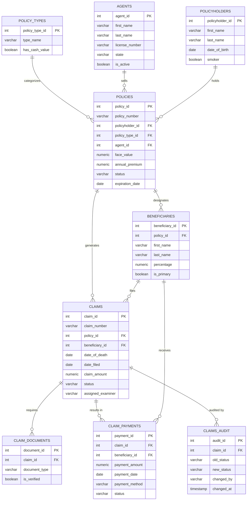

# Life Insurance Claims Database

A PostgreSQL relational database modeling the full lifecycle of life insurance policies and claims — from policy issuance through beneficiary payment. Includes schema design, seed data, analytical queries, views, triggers, and stored procedures. Designed to demonstrate production-level database skills and insurance domain knowledge.

---

## Entity Relationship Diagram



---

## Schema

**9 tables** with enforced referential integrity, check constraints, and indexes.

| Table | Description |
|-------|-------------|
| `policy_types` | Life insurance product categories (Term, Whole, Universal, Variable, Final Expense) |
| `agents` | Licensed agents with state, credentials, and active status |
| `policyholders` | Insured individuals with demographic and underwriting data |
| `policies` | Issued policies with face value, premium, riders, and status |
| `beneficiaries` | Named recipients with percentage allocations (primary & contingent) |
| `claims` | Filed claims with full workflow tracking from intake to payment |
| `claim_documents` | Supporting documents with verification status |
| `claim_payments` | Payment disbursements with method and clearance tracking |
| `claims_audit` | Immutable audit log of every status and examiner change |

---

## Files

| File | Purpose |
|------|---------|
| `schema.sql` | Tables, constraints, indexes, and comments |
| `seed_data.sql` | Core sample data — 15 policyholders, 18 policies, 18 claims |
| `seed_data_extended.sql` | Extended data — 50+ total claims for richer analytics |
| `queries.sql` | 21 queries — operations, analytics, window functions, CTEs |
| `views.sql` | 4 reusable views for common reporting needs |
| `triggers.sql` | 4 triggers — audit trail, timestamp, validation, policy check |
| `stored_procedures.sql` | 4 PL/pgSQL functions — full claims workflow automation |

---

## Queries — Full Index

| # | Query | Concepts Used |
|---|-------|---------------|
| 1 | Open Claims Aging Report | INNER JOIN, CASE |
| 2 | Average Processing Time | Aggregate, CASE, GROUP BY |
| 3 | Payouts by Policy Type | LEFT JOIN, aggregate |
| 4 | Agent Portfolio Performance | LEFT JOIN, aggregate, NULLIF |
| 5 | Claims by Cause of Death | GROUP BY, HAVING, ROUND |
| 6 | High-Value Pending Claims | INNER JOIN, WHERE filter |
| 7 | Claims Missing Documents | JOIN, STRING_AGG, HAVING |
| 8 | Monthly Claims Trend YTD | TO_CHAR, DATE_TRUNC, GROUP BY |
| 9 | Beneficiary Payment Summary | LEFT JOIN, multi-table |
| 10 | Denial Rate & Reason Analysis | Aggregate, ROUND, subquery |
| 11 | Policies Expiring in 12 Months | DATE arithmetic, INTERVAL |
| 12 | Full Claim Detail View | 6-table JOIN, LEFT JOIN |
| 13 | Running Total of Payments | **`SUM() OVER`**, **`PARTITION BY`** |
| 14 | Claims Ranked by Amount | **`RANK()`**, **`DENSE_RANK()`**, **`PARTITION BY`** |
| 15 | Examiner Queue + MoM Trend | **`ROW_NUMBER()`**, **`LAG()`**, CTE |
| 16 | Full Claim Detail (parameterized) | 6-table JOIN |
| 17 | Coverage Gap Analysis | **`FULL OUTER JOIN`** |
| 18 | Complete Outreach Contact List | **`UNION`** |
| 19 | Policyholders With No Claims | **`EXCEPT`** |
| 20 | Claims Funnel Analysis | **Multi-step CTE**, LAG window |
| 21 | Index Performance Check | **`EXPLAIN ANALYZE`** |
| 22 | Age Band Segmentation | CASE banding, claim rate by age at issuance |
| 23 | Customer Tenure Analysis | `DATE_PART`, `AGE()`, tenure tier grouping |
| 24 | Age × Tenure Matrix | Cross-segment profitability — premium-to-claim ratio |

---

## Triggers

| Trigger | Table | Event | Purpose |
|---------|-------|-------|---------|
| `trg_claims_updated_at` | `claims` | BEFORE UPDATE | Auto-sets `updated_at = NOW()` on every row change |
| `trg_claims_audit` | `claims` | AFTER INSERT/UPDATE | Writes immutable record to `claims_audit` on every status or examiner change |
| `trg_validate_beneficiary_pct` | `beneficiaries` | BEFORE INSERT/UPDATE | Prevents primary or contingent allocations from exceeding 100% per policy |
| `trg_check_policy_active_at_death` | `claims` | BEFORE INSERT | Raises exception if death precedes policy issue; NOTICE if policy is expired or lapsed |

---

## Stored Procedures

| Function | Returns | Purpose |
|----------|---------|---------|
| `file_new_claim(policy_id, beneficiary_id, date_of_death, cause, notes)` | `claim_number` | Validates policy status, coverage dates, and beneficiary ownership; creates and returns the new claim |
| `update_claim_status(claim_number, new_status, examiner, denial_reason, notes)` | `void` | Enforces valid status transitions; requires denial reason; sets decision dates automatically |
| `assign_examiner(claim_number)` | `examiner_name` | Assigns the examiner with the lowest current open-claim workload; advances to under_review |
| `process_claim_payment(claim_number, payment_method, check_number)` | `payment_id` | Creates payment record for an approved claim; marks claim as paid |

---

## Views

| View | Purpose |
|------|---------|
| `vw_open_claims` | All active claims with aging status (On Track / Aging / Overdue) |
| `vw_claims_summary` | Full claim context with processing time metrics |
| `vw_agent_performance` | Agent-level policy and claims metrics |
| `vw_payments_pending` | Approved claims awaiting payment disbursement |
| `vw_customer_segments` | One row per policyholder — age band, tenure tier, current age, total coverage, claims filed |

---

## How to Run

```bash
# Create the database
createdb life_insurance_claims

# Load in order
psql -d life_insurance_claims -f schema.sql
psql -d life_insurance_claims -f seed_data.sql
psql -d life_insurance_claims -f seed_data_extended.sql
psql -d life_insurance_claims -f triggers.sql
psql -d life_insurance_claims -f stored_procedures.sql
psql -d life_insurance_claims -f views.sql
psql -d life_insurance_claims -f queries.sql
```

### Quick start in psql
```sql
-- Open claims with aging
SELECT * FROM vw_open_claims ORDER BY days_open DESC;

-- Pending payments
SELECT * FROM vw_payments_pending;

-- File a new claim end-to-end
SELECT file_new_claim(6, 18, '2025-01-15', 'Natural causes', 'Filed by spouse');
SELECT assign_examiner('CLM-2025-00500');
SELECT update_claim_status('CLM-2025-00500', 'approved', 'Sarah Donovan', NULL, 'All docs verified');
SELECT process_claim_payment('CLM-2025-00500', 'wire_transfer');

-- Audit trail
SELECT * FROM claims_audit ORDER BY changed_at DESC;
```

---

## Key Design Decisions

**`ssn_last4` only** — Full SSN stored in a secure external vault; only last 4 digits in the application database to minimize PII exposure.

**Status check constraints** — `claims.status` and `policies.status` enforce valid values at the database level, not just the application layer.

**Immutable audit log** — `claims_audit` records every status and examiner change with timestamp and user, providing a complete chain of custody for every claim decision.

**Contestability clause modeled** — Denial scenarios include the 2-year suicide exclusion and lapse-period death — real adjudication rules in life insurance.

**Trigger-based beneficiary validation** — Prevents over-allocation at the database level; primary and contingent tiers validated independently.

**Age and tenure as first-class fields** — `age_at_issue` is stored as a snapshot on each policy (immutable, used for actuarial banding). `policyholder_since` on policyholders tracks the customer relationship start date, enabling tenure segmentation and lapse analysis. Both are auto-populated via UPDATE after seed data is loaded.

**Stored procedure workflow** — `file_new_claim → assign_examiner → update_claim_status → process_claim_payment` mirrors a real claims adjudication pipeline.

---

## Skills Demonstrated

| Category | Skills |
|----------|--------|
| **Database Design** | Normalization, relational modeling, foreign keys, check constraints, indexes |
| **SQL — Joins** | INNER JOIN, LEFT JOIN, FULL OUTER JOIN, multi-table joins (6+ tables) |
| **SQL — Set Operations** | UNION, EXCEPT |
| **SQL — Aggregates** | GROUP BY, HAVING, COUNT, SUM, AVG, ROUND, NULLIF, STRING_AGG |
| **Window Functions** | `SUM() OVER`, `RANK()`, `DENSE_RANK()`, `ROW_NUMBER()`, `LAG()`, `PARTITION BY`, `ROWS BETWEEN` |
| **CTEs** | Single-step, multi-step chained CTEs, CTE with window functions |
| **Triggers** | BEFORE/AFTER, INSERT/UPDATE, row-level, validation and audit patterns |
| **Stored Procedures** | PL/pgSQL, exception handling, status transition logic, sequence generation |
| **Performance** | Indexes, `EXPLAIN ANALYZE`, query plan analysis |
| **Insurance Domain** | Policy types, beneficiary allocation, claims adjudication, contestability, audit compliance |

---

*Lisa Lewandowski · [GitHub: L2LML](https://github.com/L2LML)*
