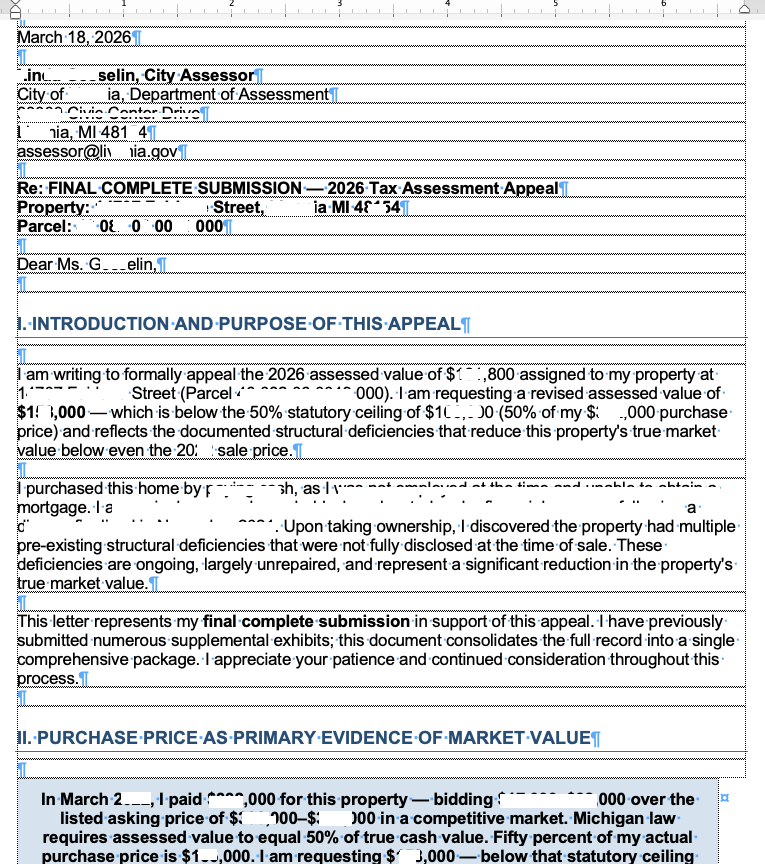
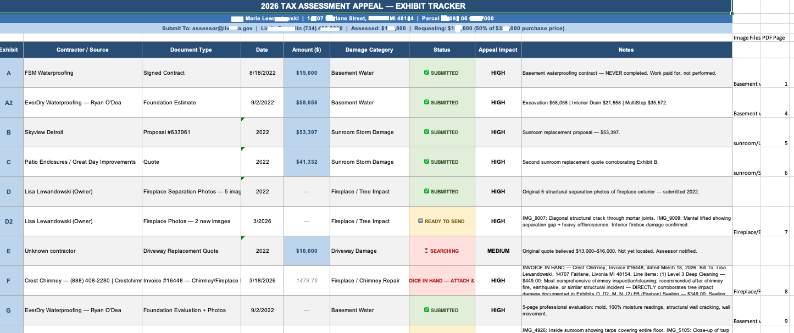
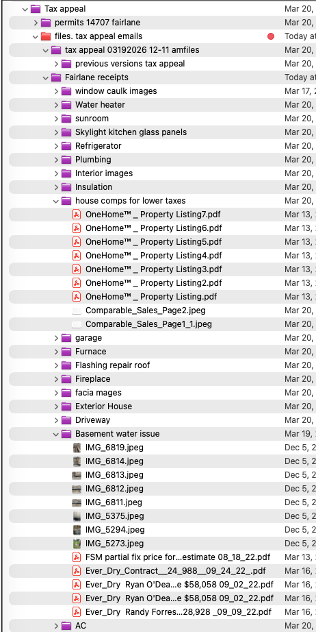
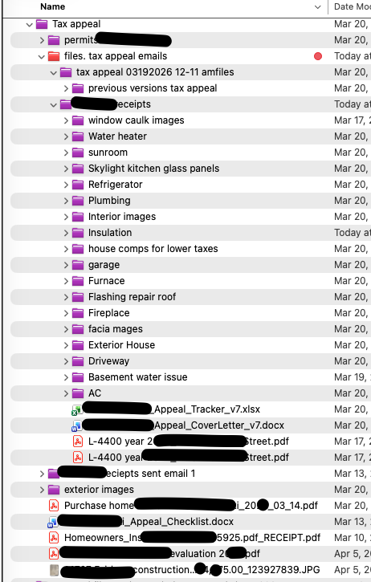

# Tax Assessor Doc Skill

> A Claude AI skill that turns a pile of repair receipts, contractor estimates, and damage photos into an organized, submission-ready property tax assessment appeal — automatically.


---

## 🧩 What Problem It Solves

Property tax appeals require organizing dozens of documents — contractor estimates, repair invoices, damage photos, insurance records — into a coherent, exhibit-labeled submission. Doing this manually means hours of sorting, renaming, calculating totals, and drafting emails.

This Claude skill does it automatically. Upload any document or photo, and the skill reads it, extracts the key data, assigns it an exhibit letter, updates a running damage total in Excel, and generates a ready-to-send email to the assessor's office — all in one step.

Built for homeowners who need to challenge an assessed property value based on documented repair costs and structural damage.

---

## 🎬 Demo / Screenshots

### Appeal Letter — Structured Output


### Exhibit Tracker — Running Damage Total in Excel


### File Organization with Comparables


### File Organization — Full Document Set


---

## 🛠️ Built With

| Tool | Purpose |
|------|---------|
| [Claude AI](https://claude.ai) | Document reading, data extraction, email drafting |
| [openpyxl](https://openpyxl.readthedocs.io) | Excel tracker creation and updates |
| Claude Skill (SKILL.md) | Persistent workflow trigger and logic |

---

## 🚀 How to Use

### Prerequisites
- Claude.ai account (Pro recommended for file uploads)
- The `tax-assessor-docs` skill installed in Claude Settings → Skills

### Step-by-Step
1. Open a new Claude chat
2. Upload any document — a PDF estimate, photo of damage, receipt, or invoice
3. Claude reads it and confirms: *"Found: Contractor Name — $X,XXX — Category → Logging as Exhibit A. Correct?"*
4. Confirm (or just let it auto-proceed for clear documents)
5. Claude logs it to your Excel tracker, updates your running damage total, and generates the exact email text to send to your assessor
6. Repeat for every document — each one builds your case

### What it handles
- PDF contractor estimates and invoices
- Damage photos (identifies what damage is visible and where)
- Receipts and contracts
- Insurance documentation
- Duplicate detection — warns you if a document was already logged

---

## 💬 Prompts Used

### Core Trigger Description
```
Use this skill whenever the user uploads or mentions ANY document, photo, estimate,
receipt, invoice, contract, or bill related to home repairs or damage — even if they
just say "here's another one", "I found the quote", or "scan this".
```
**Why it works:** The broad casual-language triggers prevent the skill from missing uploads phrased informally — which is how people actually talk when they're in the middle of a task.

### Document Extraction Prompt Pattern
```
Read this document and extract:
- Vendor/contractor name and contact
- Date
- Document type (estimate / invoice / contract / receipt)
- Dollar amount(s)
- Scope of work — what damage or repair does it describe?

Then confirm: "[Vendor] — $[Amount] — [Type] → Logging as Exhibit [X]. Correct?"
```
**Why it works:** Asking for confirmation before logging prevents silent errors. The one-line summary format makes it fast to review without reading a wall of text.

### Email Generation Pattern
```
Generate the exact ready-to-send email the user should forward to the assessor,
using the standard subject line format and including the exhibit letter,
document name, and one-sentence description of what it proves.
```
**Why it works:** Giving users copy-paste-ready text removes friction. The more friction in the submission process, the fewer documents get sent — which weakens the appeal.

---

## 🎓 Lessons Learned

1. **Casual language triggers matter more than formal ones** — Users say "here's another one" not "please process this document." The skill description has to match how people actually talk mid-task, not how they'd write a formal request.

2. **Confirmation before logging beats silent automation** — A one-line confirm step ("Logging as Exhibit D. Correct?") catches misreads before they corrupt the tracker. It also builds user trust in the automation.

3. **Running totals change behavior** — Showing the updated damage total after every document motivated finding more documents. The number made the stakes concrete.

4. **Copy-paste email output is the highest-value feature** — The ready-to-send email snippet was used more than any other output. Remove the friction between "I have this document" and "I sent this document."

5. **Photos need different extraction logic than PDFs** — A damage photo requires describing what is visually present and where on the property it is. PDFs have structured data to extract. The skill handles both, but they need separate logic paths.

6. **Duplicate detection prevents tracker corruption** — Without it, the same document gets logged multiple times across sessions. A simple check against existing exhibit letters catches most cases.

---

## 🔭 Future Improvements

- [ ] Auto-generate a full appeal cover letter summarizing all exhibits
- [ ] PDF bundle builder — combine all exhibits into one submission-ready PDF
- [ ] Comparable property lookup to strengthen the valuation argument
- [ ] Deadline tracker — alert when appeal window is approaching
- [ ] Multi-property support for managing appeals across more than one address

---

## 📁 Folder Structure

```
L2LML-tax-assessor-docs/
├── README.md
├── prompts/
│   └── prompts_used.md        ← Full prompt documentation
├── assets/
│   └── screenshots/           ← App in action
├── src/
│   └── SKILL.md               ← The installable Claude skill
└── CHANGELOG.md
```

---

## 📄 License

MIT License — free to use, adapt, and build on for your own tax appeal.

---

> **Privacy note:** This README contains only public-facing information.
> Case-specific details including addresses, parcel numbers, assessor contacts,
> and dollar amounts are kept in the private working files only — never published.

*Built by [@L2LML](https://github.com/L2LML) using [Claude AI](https://claude.ai)*
